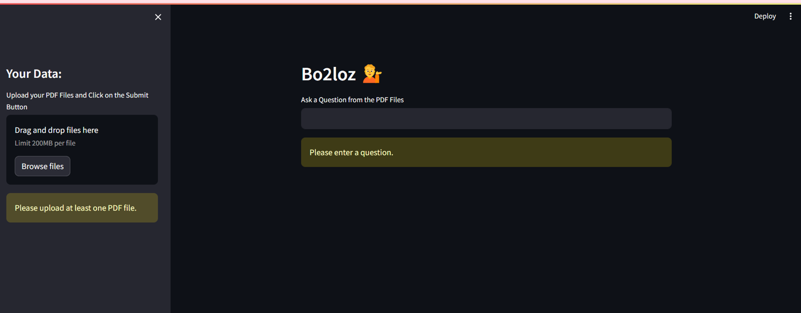

# Bo2loz: A Conversational AI for PDF Files

## Introduction
Bo2loz is a conversational AI that allows users to ask questions about PDF files and receive detailed answers. This project uses the Langchain library to process PDF files, extract text, and generate answers to user questions.

## Getting Started

### Installation
1. create a python virtual environment to avoid dependency compatibility issues
2. install the dependancies `pip install -r requirements.txt`

### Running the Application
`streamlit run app.py`

### NOTE: Environment Variables
Set the GOOGLE_API_KEY environment variable to your Google API key. You can do this by creating a .env file with the following content:
`GOOGLE_API_KEY=YOUR_API_KEY_HERE`
Replace YOUR_API_KEY_HERE with your actual Google API key.